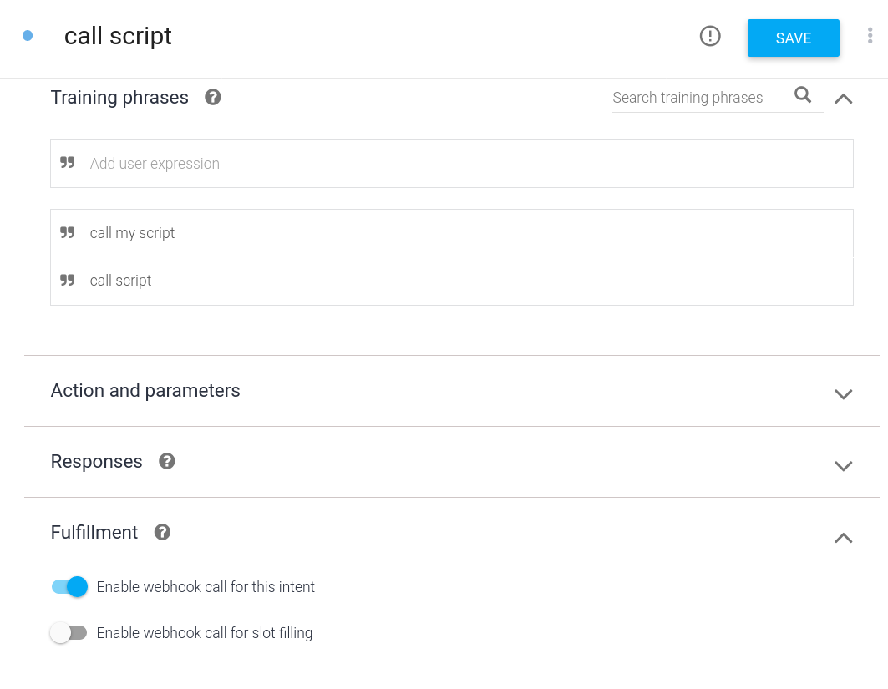
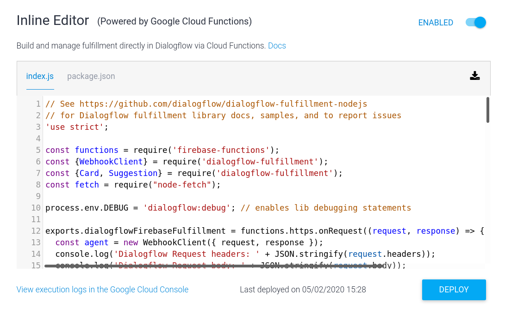
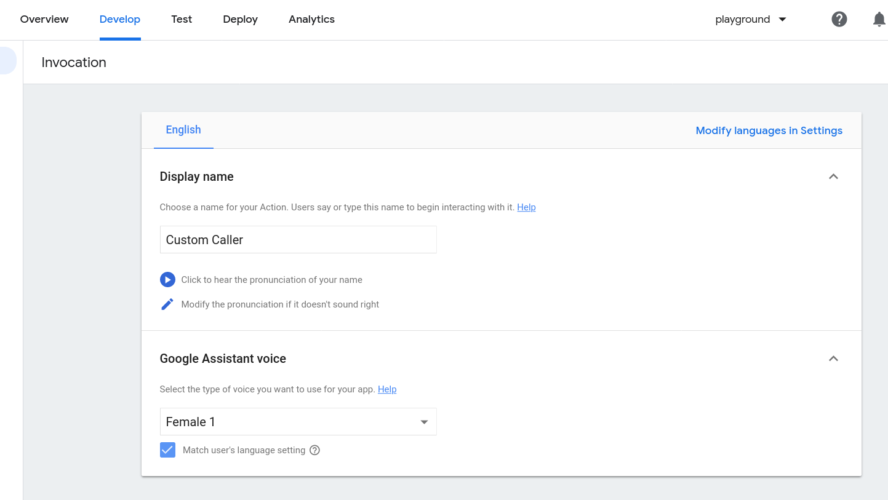
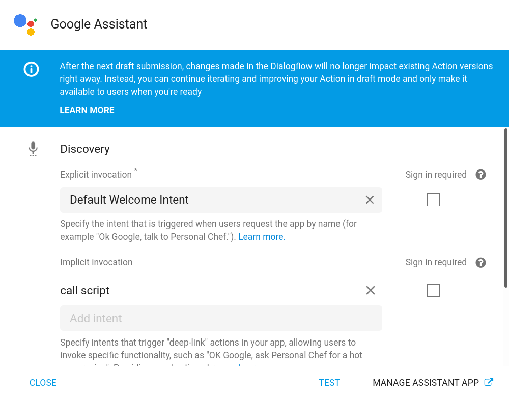

# Google home > local script
Enabling a voice command given to google home to trigger a custom local script!
## Basic implementation
* We host a flask RESTful API on our machine locally.
* We use `ngrok` to expose it to the big wide world.
* A custom dialogflow fulfillment script (written on the Dialogflow Fulfillment console and deployed to firebase) calls this exposed API when a certain phrase is said to the Google assistant (on the google home, in our case.)

## Steps
* Host the server locally:
```bash
python api.py
```
* Expose it everywhere with `ngrok` (install it if you have'nt). Feel free to replace the localhost url with your own.
```bash
ngrok http http://127.0.0.1:5000
```
* Create a new project on DialogFlow and create an intent. **Enable webHook calls for it**.

* Write a cloud function in the **Fulfillment tab**. Enable it of course. 

In our case, we make an API call. To do this, add `"node-fetch" : "^2.6.0"` as a dependency in your `package.json` and include it in the script with `const fetch = require("node-fetch");` at the top.

* Add the function:
```javascript
function callScript(agent){
    const url = 'https://2d8ca963.ngrok.io/customRoute/rohan'; // the ngrok url with which we exposed our localhost
    fetch(url).then((response)=>{
        //do stuff
    });
    agent.add(`Calling your script...`); // only this is returned as a respose from the agent.
}
```
..and link it with the intent:
```javascript
intentMap.set('call script', callScript);
```

* Whoa! We're not done yet. Set a display name on the Actions console - has to be valid and is probably not the default one. It's *Custom caller* below.


* Link it with google home! Click on integrations and find google home to get here. Set your custom intent (`call Script` here) as an *Implicit invocation* so that we can call it more easily.


#### And we're done!
You can now say (for example):
> Ok Google, can you ask Custom caller to call my script?
 
(on a Google Device logged in with the *same account* as the account on the Dialogflow console) and it shall trigger the API endpoint you've defined where you can do absoloutely anything you can imagine.